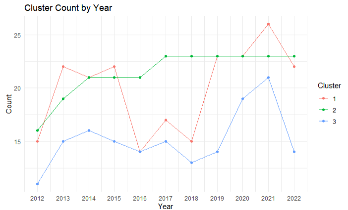
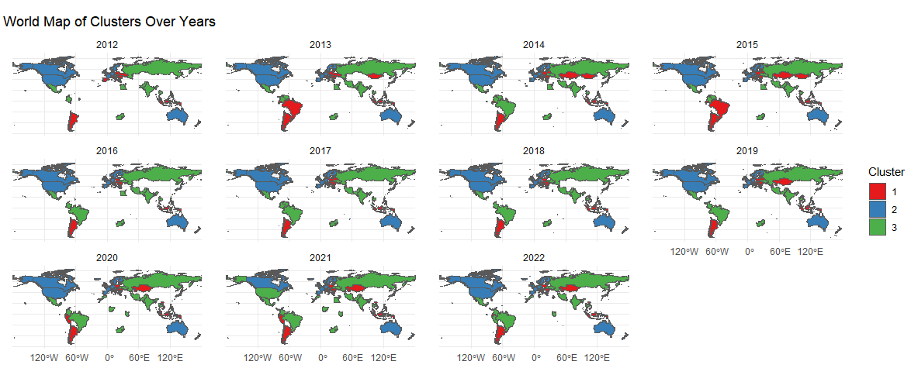
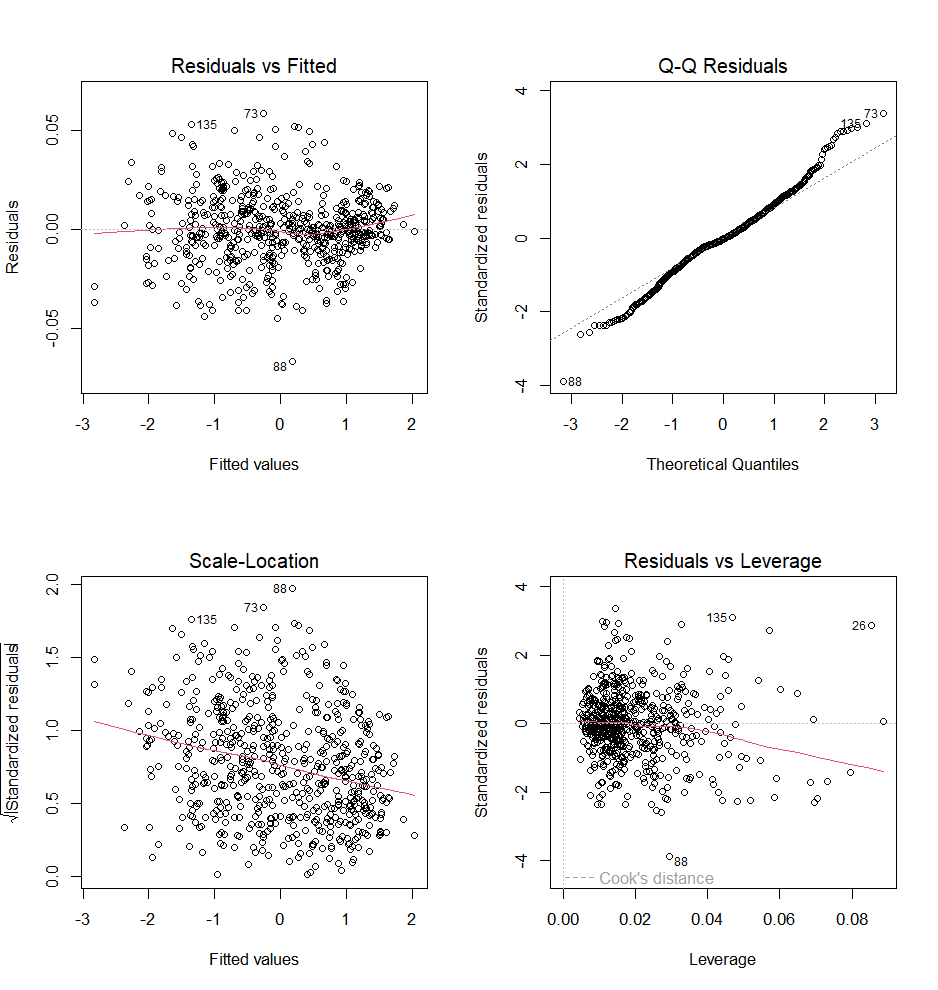

# 🌍 The Pursuit of Utopia – MGT6203 Final Project

## Overview

This repository contains the complete codebase, data, and methodology for Team 24's final project in *MGT6203: Data Analytics in Business*. The goal of our project is to build a comprehensive, data-driven **Utopian Cumulative Index** that evaluates and compares countries across three core dimensions:

- **World Happiness Index (WHI)**
- **Global Peace Index (GPI)**
- **Quality of Life Index (QOL)**

Together, these indices represent a holistic view of a nation's development in pursuit of an ideal society — Utopia.

---

## 📌 Project Objectives

- Develop a **Utopian Index** as a benchmark for global development.
- Measure how far each country is from Utopia in terms of happiness, peace, and quality of life.
- Recommend actionable insights for governments using data modeling, forecasting, and clustering.

---

## 🗂️ Dataset Sources

- **WHI**: [World Happiness Report](https://worldhappiness.report/ed/2023/#appendices-and-data)
- **QOL**: [Numbeo Quality of Life Index](https://www.numbeo.com/quality-of-life/rankings_by_country.jsp?title=2023)
- **GPI**: [Vision of Humanity – Global Peace Index](https://www.visionofhumanity.org/maps/)
- Data scraping performed using **Octoparse** and custom scripts.

---

## 🧹 Data Preparation Steps

- Merged WHI, GPI, and QOL datasets across different years and formats.
- Cleaned null/NA values by dropping rows with insufficient data.
- Categorical variables (e.g., `political.instability`, `access.to.weapons`) were factorized.
- Numerical variables were normalized to allow fair comparison across indexes.
- Constructed a **Cumulative Index** as the dependent variable combining all three dimensions.

---

## 📊 Exploratory Data Analysis

- **Univariate Analysis** using QQ plots.
- **Correlation Mapping** between dependent and independent variables.
- **Categorical Variable Distributions** to understand sociopolitical patterns.
- **Heatmaps and Boxplots** for visual insights.

---

## 📈 Modeling Approaches

### 1. 🔁 **Regression Models**
- **Stepwise Regression**: High R² = 0.9999 with 28 significant features.
- **Lasso Regression**: Achieved R² = 0.9996 with just 9 variables — best for interpretability.
- **Elastic Net**: Combined benefits of Lasso & Ridge with R² = 0.9997 (11 variables).

> 🏆 **Lasso Regression** selected as best balance between accuracy and parsimony.

### 2. 🎯 **K-Means Clustering**
- Used **Elbow Method** to determine `k = 3`.
- Segmented countries into 3 socioeconomic tiers.
- Cluster transitions tracked over time to assess global development trends.

### 3. 🌍 **Geospatial Analysis**
- Mean Utopian Index mapped by continent.
- Top-performing regions: Oceania > Europe > North America.
- Africa and South America remain the most development-challenged.

### 4. 🔮 **Time Series Forecasting**
- Forecasted index trends (2012–2022) using:
  - ARIMA (Switzerland)
  - Simple Exponential Smoothing (Iran, Mexico)
- Model selected based on RMSE per country.

### 5. 🧪 **Hypothesis Testing**
- GDP positively influences QOL, life expectancy, and inversely correlates with pollution and commute time.
- Health indicators serve as both cause and consequence of economic prosperity.

---

## 📊 Sample Visuals

  
  
  

*(Note: Save figures in `images/` folder and link them here)*

---

## ⚠️ Unexpected Challenges

- **Climate Index** introduced in QOL data from 2015 onward — caused data imbalances.
- Limited time series depth (11 points) restricted model robustness.
- K-means clusters are hard to interpret without subjective assumptions.
- Risk of overfitting due to high R² from imputed missing values.

---

## ✅ Conclusion

This project combines multidisciplinary modeling to provide a powerful tool for benchmarking countries against a utopian ideal. By integrating economic, social, and environmental indicators, governments can assess gaps and prioritize policy initiatives to promote global well-being.

---

## 📚 References

- World Happiness Report 2023 – [worldhappiness.report](https://worldhappiness.report)
- Numbeo Quality of Life – [numbeo.com](https://www.numbeo.com/quality-of-life)
- Vision of Humanity – Global Peace Index – [visionofhumanity.org](https://www.visionofhumanity.org/maps)
- Rahm & Do (2000) – “Data Cleaning: Problems and Current Approaches”

---

